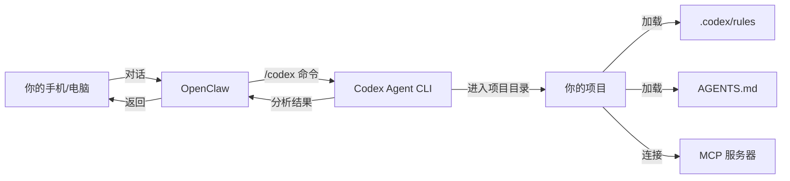
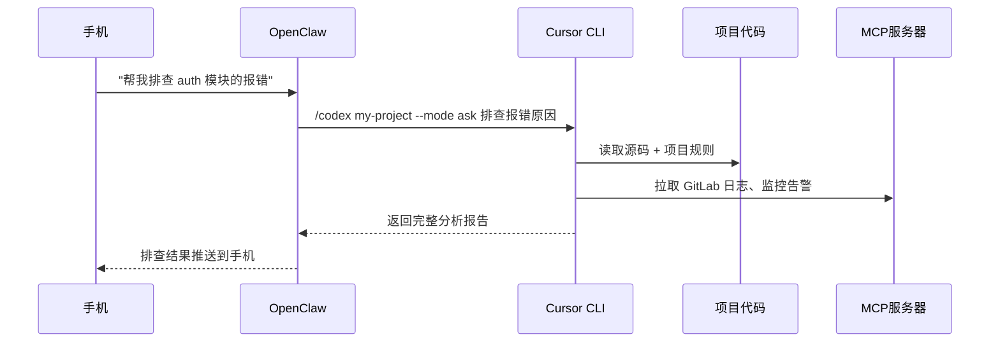
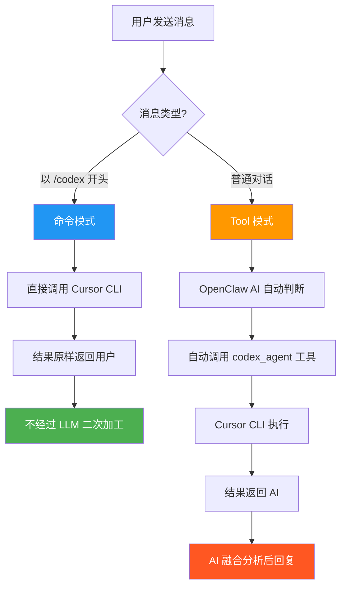
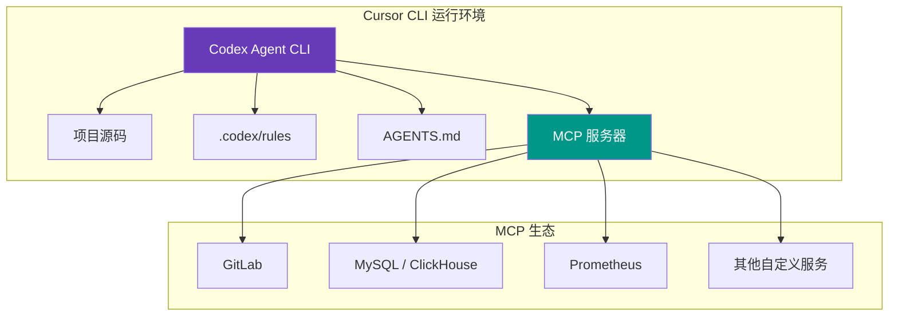
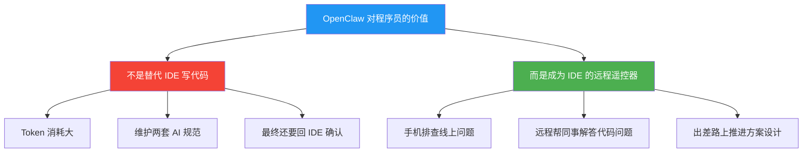

# OpenClaw 插件推荐：对接 Cursor CLI，让 AI 编程走出 IDE

---

> AI 进化时代，我们需要在不确定性中寻求确定性。工具在变、模型在变、范式在变——但有一件事是确定的：**你的项目规范、你的代码资产、你和 AI 磨合出来的默契，不应该随工具的切换而归零。**

---

OpenClaw 火了很久了。

火的时候我就开始研究，看了大量使用教程，越看越觉得——**对程序员来说，这些用法都差了点意思。**

今天不教你用 OpenClaw 做日报、定闹钟。我要解决一个根本问题：**如何让 OpenClaw 真正融入程序员的开发工作流，而不是成为一个花架子。**

<br/>

## 一、目前教程的两个典型"姿势"，都有问题

翻遍全网教程，核心用法无非两种：

<br/>

### 姿势一：让 OpenClaw 当生活助手——定时任务

"每天早上推送科技新闻""每周总结行业动态""定时提醒喝水"……

定时任务确实有用，但说实话——**每天定时推送各种信息，对我是伪需求**。我想知道的，我会自己去找。没有主动想知道的，推给我也不会看。这个场景的适用范围并不广。

<br/>

### 姿势二：让 OpenClaw 直接写项目

这个问题更大：

**1. Token 消耗巨大。** OpenClaw 作为通用聊天入口，跑一个完整项目，token 烧得心疼。

**2. Prompt 工程不如专业 IDE。** OpenClaw 是通用智能体，prompt 体系面向对话，不面向编码。论代码生成的系统提示词、上下文管理、文件操作，跟 Cursor、Claude Code 这些专业 AI 编辑器不是一个量级。

**3. 最致命的：你不可能用聊天工具写完项目直接上线。** 无论 AI 多强，项目最终一定要回到 IDE 做 review、调试、测试。这是开发流程决定的。

<br/>

## 二、一个被忽视的核心问题

既然最终要回归 IDE，那就产生了一个棘手的问题：

> **OpenClaw 里写的代码、积累的规范（Skill）、项目宪章——怎么和 IDE 保持一致？**

你在 OpenClaw 里调教了半天 AI 的行为规范，回到 Cursor 里又是一套完全不同的上下文。两边各玩各的，相当于你同时在教两个 AI 做事，效率反而更低。

这里有一个更深层的认知：

> **AI 协同过程中，你一定要越来越熟悉一个 IDE 和一个大模型——就像你要熟悉一个人一样。** 换来换去，你永远停留在"磨合期"。

这就是我说的"在不确定性中寻求确定性"——**模型会迭代、工具会更新，但你和一套工作流之间建立的深度默契，才是真正的竞争力。**

<br/>

## 三、想明白了：让 OpenClaw 调用 Cursor CLI

基于上面的问题，我一直没想清楚 OpenClaw 对程序员的真正价值在哪，所以迟迟没有动笔。

现在想通了——**不要让 OpenClaw 自己写代码，让它调用 Cursor CLI 去完成任务。**

什么意思？看下面这个架构：



**核心思路**：OpenClaw 不写代码，它只负责"启动" Cursor CLI，让 Cursor 在你的项目目录中工作。

这样带来一个关键好处——**项目一致性**。

你在电脑面前用 Cursor IDE，和你通过 OpenClaw 启动 Cursor CLI，**本质上是一回事**。因为都是进入同一个项目目录，加载同样的 `.codex/rules`、`AGENTS.md`、MCP 配置。你的项目宪章、编码规范、上下文——全部复用。

**这就是确定性。** 无论你从哪个入口进来，AI 的行为是一致的。

<br/>

## 四、真实场景

<br/>

### 场景一：手机远程排查问题

你在外面吃饭，线上告警了。

以前：赶紧找电脑、开 VPN、打开 IDE……

现在：掏出手机，打开 OpenClaw：



Cursor CLI 会连接项目配置的 MCP 服务器（GitLab、数据库、Prometheus 等），**直接从源码和运维数据两端完成排查**。等回到电脑前，打开 IDE 确认即可。

<br/>

### 场景二：同事问你项目细节

同事问你："这个接口的鉴权逻辑是怎么实现的？"

以前：打开 IDE、翻代码、截图、写文字解释……

现在：直接甩给 OpenClaw：

```
/codex my-project --mode ask 解释用户鉴权接口的完整实现逻辑，包括中间件链路
```

**AI 替你读代码、替你回答，答案基于你真实项目源码**——不是泛泛而谈的通用回答。

<br/>

### 场景三：出差路上推方案

```
/codex my-project --mode plan 设计一个缓存层方案，支持 Redis + 本地缓存两级架构
```

Cursor 会基于你项目的现有架构出方案，回到电脑前直接推进。

<br/>

## 五、插件介绍：codex-agent

说了这么多理念，介绍具体实现。

**codex-agent** 是一个 OpenClaw Gateway 插件，做的事很简单：**在 OpenClaw 聊天中直接调用本机的 Codex Agent CLI**。

> GitHub：https://github.com/toheart/codex-agent

<br/>

### 两种调用方式：命令模式 vs Tool 模式

这是理解插件的关键：



<br/>

**命令模式** `/codex` —— 你明确知道要做什么

直接输入 `/codex` 命令，插件立刻调用 Cursor CLI，结果**原样返回，不经过 LLM 二次总结**。

适用于：
- 你很清楚要分析哪个模块
- 你需要未被 AI "润色"的原始输出
- 需要继续或恢复之前的会话

```bash
# 分析模块
/codex my-project --mode ask 分析 src/auth 的架构设计

# 继续上次对话
/codex my-project --continue 还有哪些安全隐患？

# 修改代码
/codex my-project --mode agent 给用户服务添加分布式限流
```

<br/>

**Tool 模式** —— 让 AI 自动判断

你正常聊天，OpenClaw 的 AI 自动判断"这个问题需要看代码"，然后**主动调用** `codex_agent` 工具。

适用于：
- 开放式讨论，不确定需不需要看代码
- 希望 AI 融合代码分析给出建议
- 出于安全，默认只读（`ask` 模式），不修改文件

<br/>

**两种模式对比：**

| 维度 | 命令模式 `/codex` | Tool 模式 |
|------|-------------------|-----------|
| 触发方式 | 你主动输入命令 | AI 自动判断调用 |
| 结果处理 | 原样返回，不经 LLM | AI 可融合补充 |
| 默认权限 | `agent`（可改文件） | `ask`（只读） |
| 会话管理 | 支持 continue/resume | 不支持 |
| 适合场景 | 精确任务、代码修改 | 开放讨论、智能分析 |

<br/>

### 为什么复用项目的 MCP 配置很重要？

你的 Cursor 项目可能配了各种 MCP 服务器：

- **GitLab MCP**：查 MR、查流水线
- **数据库 MCP**：查线上数据
- **Prometheus MCP**：查监控指标
- **ClickHouse MCP**：查日志分析

通过 codex-agent 调用 Cursor CLI 时，这些 MCP 配置**自动生效**。也就是说，你用手机远程排查问题时，AI 不只是看代码——它还能直接查数据库、看监控、翻 GitLab，拿到和你坐在电脑前一样的完整上下文。



<br/>

## 六、快速上手

**第一步：安装 Codex Agent CLI**

```bash
# Linux / macOS
curl https://codex.com/install -fsSL | bash

# Windows（PowerShell）
irm https://codex.com/install | iex

# 验证 & 登录
agent --version
agent login
```

**第二步：安装插件**

在 `~/.openclaw/openclaw.json` 中添加：

```json
{
  "plugins": {
    "load": {
      "paths": ["/path/to/codex-agent"]
    },
    "entries": {
      "codex-agent": {
        "enabled": true,
        "config": {
          "projects": {
            "my-project": "/home/user/projects/my-project",
            "backend": "/home/user/projects/backend-api"
          },
          "enableMcp": true,
          "enableAgentTool": true
        }
      }
    }
  }
}
```

**第三步：开始使用**

```
/codex my-project 帮我分析一下认证模块，有没有安全隐患
```

<br/>

## 七、写在最后



核心观点就一句话：

> **不要让 OpenClaw 干 IDE 的活。让它成为你操控 IDE 的遥控器。**

你的规范在 Cursor 项目里，你的 MCP 配置在 Cursor 项目里，你的上下文在 Cursor 项目里——OpenClaw 只需要"按一下按钮"，让 Cursor CLI 去干活就好。

AI 时代什么都在变，但有一件事值得你投入：**深度掌握一套工作流，让它成为你确定性的支点。** 工具会来来去去，但你和工作流之间建立的默契——那才是不会贬值的资产。

项目已开源，欢迎 Star 和交流：

> https://github.com/toheart/codex-agent

---

**关注「小唐的技术日志」，持续分享 AI 编程工作流的实战经验。**

如果这篇文章对你有启发，欢迎**转发、点赞、在看**，让更多程序员看到。
